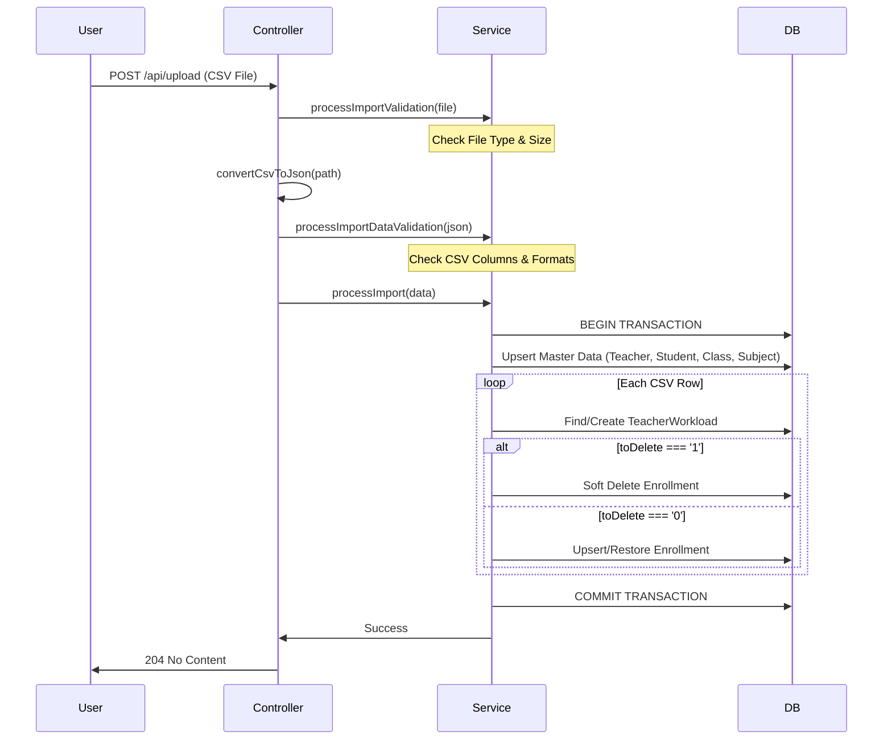
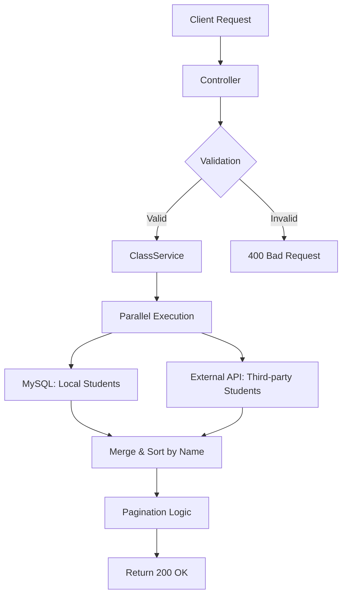
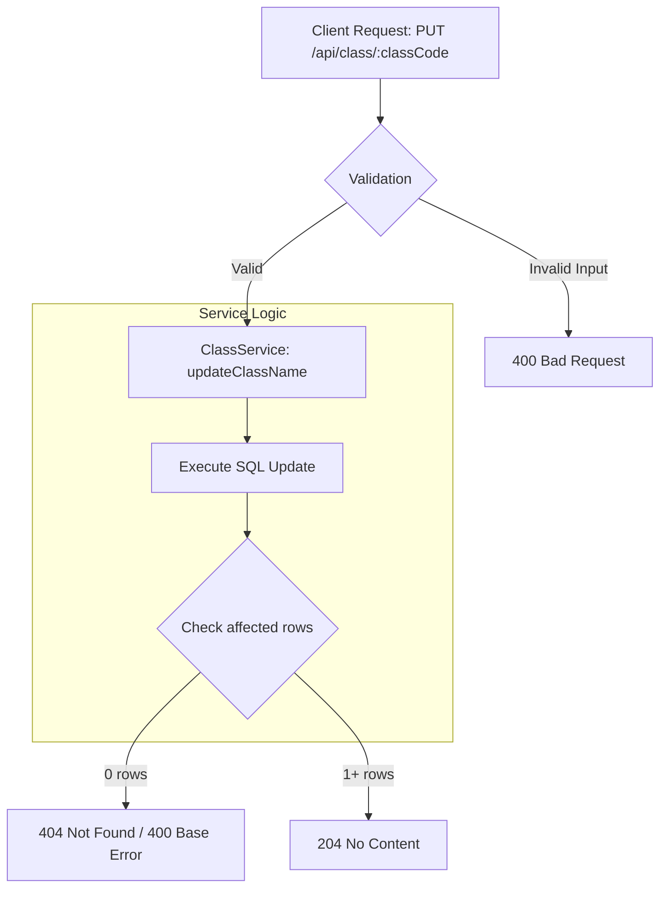
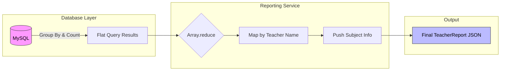

# Project Environment

1. `External Project` and `Postgres` is being containerization with Docker.
2. NodeJs is designed to run locally with `npm run start:dev`

# Prerequisites
| Stack | Stack / Version|
| -- | -- |
| NodeJs|  `v24.11.1`|
| Framework| `ExpressJS`|
| ORM | `Sequelize` |
| Database | `MySql 8.0`|
| HTTP Client | `Axios` |
| Multipart Parser | `Multer`|
| CSV Parser | `csv-parser`|
| Logger | `WinstonJS`|
| Test Runner | `Jest` |

# Import Postman collection for easier API testing
1. You can get the latest set of JSON collection for Postman at root directory of this project `/dataset/school-administration-system.postman_collection.json`
2. Get the file and import in Postman.

# API Endpoints

| Method | Endpoint | Description | Sample |
| --- | --- | --- | --- |
| POST | `/api/upload` | Upload CSV for insert/update/delete Teacher/Student/Class/Subject data.| `localhost:3000/api/upload` |
| GET | `/api/class/:classCode/students` | Retrieve students with combination of internal and external students by classCode. | `localhost:3000/api/class/111/students?offset=0&limit=100` |
| PUT | `/api/class/:classCode` | Update class name by class code. | `localhost:3000/api/class/P1-1`|
| GET | `/api/reports/workload` | Teacher workload report.| `localhost:3000/api/reports/workload` |

# Running the App

1. git clone https://github.com/laihantao/education_platform.git
2. cd to the project directory `Example: D:\Hantao\development\interview-examination\education_platform\typescript>`
3. Install necessary packages by `npm install`
4. Make sure there is `Docker` running in your computer.
5. Run NodeJs project with `npm run start:dev`
6. It might suffer few seconds `Retry` as it is initializing the database.
7. When the program is ready, you will see `🚀 Server on http://localhost:3000`
8. You can call healthcheck API to test if it is works.

        Method: GET
        Endpoint: localhost:3000/api/healthcheck

        Expected: OK

# Database Setup

The project uses Sequelize ORM. Tables are automatically synchronized upon server start.

**[! IMPORTANT !]**

> **Configuration Required**: After cloning the repository, you **must** create a `.env` file in the `/typescript` directory. You can use the provided `.env.sample` as a template.

### Database Connection Details
Ensure a schema named `school-administration-system` exists in your MySQL instance. If you are using the provided Docker environment, refer to the connection details below:

> **Note**: Make sure your Docker is running and have ready database.

### Connection Guide (e.g., DBeaver)
1. In DBeaver, right-click on `Database Navigator` at left-hand side. (Or just press hotkey `Ctrl + Shift + N`)
2. Select `MySql`.
3. Use the following configuration:
    - **Host**: `127.0.0.1`
    - **Port**: `33306` (Mapped via Docker)
    - **Database**: `school-administration-system`
    - **Username**: `root`
    - **Password**: `password`
4. Click **Test Connection** to verify.

# How to run test

1. After cloning the project
2. cd to the project directory `Example: D:\Hantao\development\interview-examination\education_platform\typescript>`
3. Install necessary packages by `npm install`
4. Run test with `npm test`

# Test Result
After `npm test`, the result will be generated under `/typescript/coverage/lcov-report/index.html`.
It is an auto-generated report with `--coverage` feature that included in `package.json -> "script" -> "test"`.

# Design Decisions & Highlights

### 1. Separation of Concerns (Service Layer)
The project follows a modular architecture where **Controllers** handle HTTP requests/responses, and **Services** contain the core business logic. This ensures the code is maintainable and facilitates isolated unit testing.

### 2. Robust Data Validation
Instead of relying solely on database constraints, a dedicated validation layer is implemented for each service. It uses a custom `ErrorBase` class to ensure the API returns meaningful error codes and messages (Criteria 7), preventing "dirty data" from reaching the persistence layer.

### 3. Resilient Integration (Q2)
For the student retrieval API, the system concurrently fetches data from the local MySQL DB and an external API using `Promise.all`. It includes error handling for the external service to ensure the local system remains functional even if the third-party API is down.

### 4. Idempotency & Upsert Logic (Q1)
In the CSV import process, `upsert` (update-or-insert) logic is used to handle duplicate records gracefully. This ensures that re-uploading the same file does not result in redundant data but keeps the information up to date.

### 5. Database Performance
Indices have been applied to frequently queried columns such as `email` (Teacher/Student) and `classCode` (Class) to ensure efficient lookups as the dataset grows.

# System Workflow

## DataUpload

## StudentListing

## UpdateClassName

## Teacher Workload

## References & Credits

### Technical Documentation
- [Sequelize Official Documentation](https://sequelize.org/docs/v6/core-concepts/assocs/) - Used for architecting database associations and complex queries.

### Research & Learning Resources
- **Sequelize ORM Implementation**: [PedroTech - How to Use Sequelize ORM in NodeJS](https://youtu.be/Crk_5Xy8GMA)
- **Testing Framework (Jest)**: [Web Dev Simplified - Intro to Jest](https://youtu.be/FgnxcUQ5vho) and [Code With Blake - TypeScript Jest Testing](https://youtu.be/l6C-nRG83pQ)

### Productivity Tools
- **AI Assistance**: Gemini, ChatGPT, and VS Code Copilot were utilized for code structure optimization, documentation drafting, and debugging complex TypeScript types.
